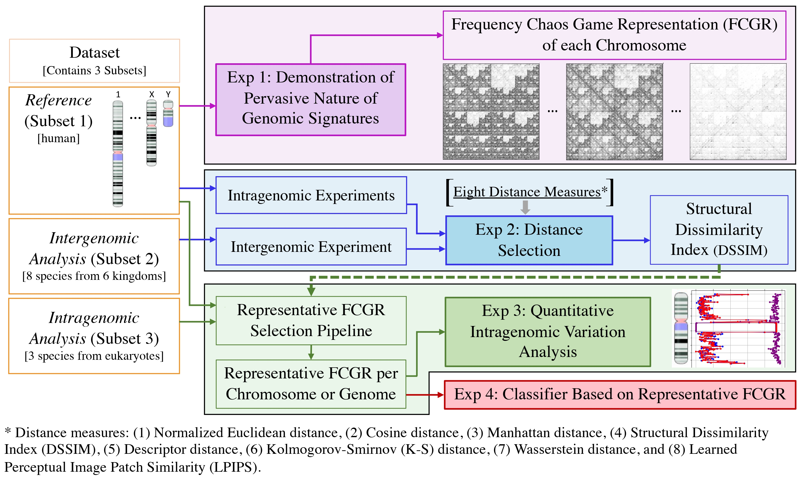

# Intragenomic_analysis

This repository contains the code for the experiments and the CGR-Diff software proposed in our paper.

## Dataset Summary

The dataset used in our paper includes genomes from various kingdoms, organized into three subsets based on the type of analysis performed: Reference (Subset 1), Intergenomic Analysis (Subset 2), and Intragenomic Analysis (Subset 3). Below is a summary of the datasets used in our experiments, along with links to their corresponding assemblies in the NCBI database.

<table>
  <thead>
    <tr>
      <th>Dataset</th>
      <th>Kingdom</th>
      <th>Species (Common Name)</th>
      <th>Assembly Link</th>
      <th>Length (Mbp)</th>
      <th>% N</th>
    </tr>
  </thead>
  <tbody>
    <tr>
      <td rowspan="1"><em>Reference (Subset 1)</em></td>
      <td rowspan="1">Animalia</td>
      <td><em>Homo sapiens</em> (human)</td>
      <td><a href="https://www.ncbi.nlm.nih.gov/datasets/genome/GCA_009914755.4/">GCA_009914755.4</a></td>
      <td>3117</td>
      <td>0</td>
    </tr>
    <tr>
      <td rowspan="8"><em>Intergenomic Analysis (Subset 2)</em></td>
      <td rowspan="3">Animalia</td>
      <td><em>Pan troglodytes</em> (chimpanzee)</td>
      <td><a href="https://www.ncbi.nlm.nih.gov/datasets/genome/GCA_028858775.2/">GCA_028858775.2</a></td>
      <td>3178</td>
      <td>0.16</td>
    </tr>
    <tr>
      <td><em>Mus musculus</em> (house mouse)</td>
      <td><a href="https://www.ncbi.nlm.nih.gov/datasets/genome/GCA_000001635.9/">GCA_000001635.9</a></td>
      <td>2723</td>
      <td>2.7</td>
    </tr>
    <tr>
      <td><em>Drosophila melanogaster</em> (fruit fly)</td>
      <td><a href="https://www.ncbi.nlm.nih.gov/datasets/genome/GCA_000001215.4/">GCA_000001215.4</a></td>
      <td>80</td>
      <td>0.57</td>
    </tr>
    <tr>
      <td rowspan="1">Fungi</td>
      <td><em>Saccharomyces cerevisiae</em> (yeast)</td>
      <td><a href="https://www.ncbi.nlm.nih.gov/datasets/genome/GCA_000146045.2/">GCA_000146045.2</a></td>
      <td>12</td>
      <td>0</td>
    </tr>
    <tr>
      <td rowspan="1">Plantae</td>
      <td><em>Arabidopsis thaliana</em> (thale cress)</td>
      <td><a href="https://www.ncbi.nlm.nih.gov/datasets/genome/GCA_000001735.2/">GCA_000001735.2</a></td>
      <td>119</td>
      <td>0.16</td>
    </tr>
    <tr>
      <td rowspan="1">Protista</td>
      <td><em>Paramecium caudatum</em>*</td>
      <td><a href="https://www.ncbi.nlm.nih.gov/datasets/genome/GCA_000715435.1/">GCA_000715435.1</a></td>
      <td>30</td>
      <td>2.16</td>
    </tr>
    <tr>
      <td rowspan="1">Archaea</td>
      <td><em>Pyrococcus furiosus</em></td>
      <td><a href="https://www.ncbi.nlm.nih.gov/datasets/genome/GCA_008245085.1/">GCA_008245085.1</a></td>
      <td>2</td>
      <td>0</td>
    </tr>
    <tr>
      <td rowspan="1">Bacteria</td>
      <td><em>Escherichia coli</em></td>
      <td><a href="https://www.ncbi.nlm.nih.gov/datasets/genome/GCA_000005845.2/">GCA_000005845.2</a></td>
      <td>5</td>
      <td>0</td>
    </tr>
    <tr>
      <td rowspan="3"><em>Intragenomic Analysis (Subset 3)</em></td>
      <td rowspan="1">Fungi</td>
      <td><em>Aspergillus nidulans</em></td>
      <td><a href="https://www.ncbi.nlm.nih.gov/datasets/genome/GCA_000011425.1/">GCA_000011425.1</a></td>
      <td>30</td>
      <td>0.04</td>
    </tr>
    <tr>
      <td rowspan="1">Plantae</td>
      <td><em>Zea mays</em> (maize)</td>
      <td><a href="https://www.ncbi.nlm.nih.gov/datasets/genome/GCA_022117705.1/">GCA_022117705.1</a></td>
      <td>2179</td>
      <td>0</td>
    </tr>
    <tr>
      <td rowspan="1">Protista</td>
      <td><em>Dictyostelium discoideum</em></td>
      <td><a href="https://www.ncbi.nlm.nih.gov/datasets/genome/GCA_000004695.1/">GCA_000004695.1</a></td>
      <td>34</td>
      <td>0.07</td>
    </tr>
  </tbody>
</table>

* Among all the species in this table, the assembly for <em>Paramecium caudatum</em> is at the scaffold level.

